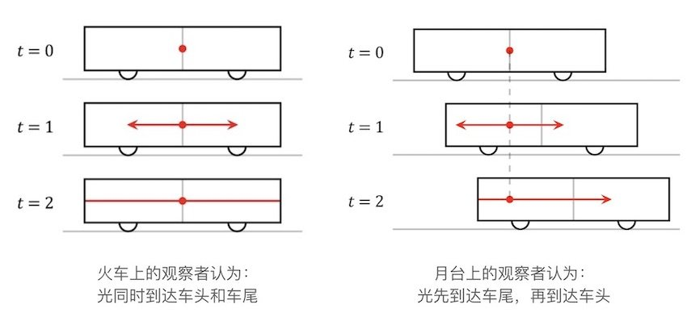
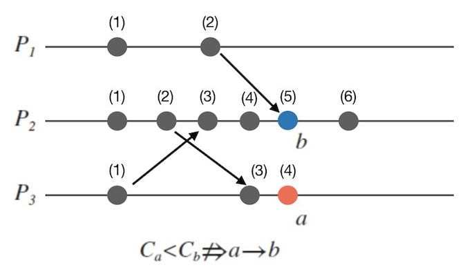

<!--more-->

## 逻辑时间戳

我们回过头来看，我们在定义完全有序、偏序的时候，我们比较的是什么？比较的是事件发生的时间，对于数据库复制系统，事件发生的时间是主库写入事件到log的事件。而在分布式系统中，我们比较的是，应用程序接收到事件的时间，但是，这并不是事件发生的时间。考虑下面的情形：

1. 进程A给进程B，C发送了一个事件a
2. 进程B收到事件a后进行处理，发送了一个事件b给进程C
3. 由于A和C之间网络问题，导致事件b比事件a先到达A，但是这显然与事实相悖的

所以，我们要做的就是用一种方式来准确刻画事件发生的顺序，而不是仅仅依赖到达的时间。那么很自然的，如果我们在发送事件的时候，带上事件的发送时间不就可以了？

但是显然不行，因为两块不同的时钟是无法做到时间完全一致的，而且由于网络延迟的存在，我们也没办法通过一个全局的时钟统一一个全局的时间。

> A man with a watch knows what time it is. A man with two watches is never sure.

就算所有节点的时间都同意，但是由于时钟漂移的存在，最终节点之间的时间也会不一致。

为了解决这个问题，著名的分布式系统科学家 Leslie Lamport在他的著名的论文「Time, Clocks and the Ordering of Events in a Distributed System」中，提出了逻辑时间戳的概念，他是从狭义相对论中得到的启发，他在论文中说：

> Special relativity teaches us that there is no invariant total ordering of events in space-time; different observers can disagree about which of two events happened first. There is only a partial order in which an event e1 precedes an event e2 iff e1 can causally affect e2.
>
> 
Leslie Lamport Time, Clocks and the Ordering of Events in a Distributed System

那么为什么不同的观察者，观察到事件发生的顺序会不一致呢？这里要说一下相对同时的概念：

> 在物理学中，同时性之相对性（英语：Relativity of simultaneity）是指超距同时性的概念并不是绝对的。换言之，在空间中不同位置所发生的事件，其同时性取决于观测者所在的参考系。
>
> 
维基百科

这里举一个著名的火车思想实验来说明。假设有观察者A在车厢中央，观察者B在月台上，当二者双目相对时，有一束光从观察者A的位置发出。

- 对A来说，由于光速是不变的，所以光到达车头和车尾的速度是一致的。
- 但是对B来说，由于火车也在移动，所以B看到的是光先到达车尾，后到达车头。

出现这个奇怪的结论，是因为，狭义相对论的一个出发点是光速不变原理。

> 光速不变原理是狭义相对论的两个基础公设之一，在狭义相对论之中，指的是无论在何种惯性参照系中观察，光在真空中的传播速度相对于该观测者都是一个常数，不随光源和观测者所在参考系的相对运动而改变。
> 
> 
维基百科

也就是说，A处在火车这个参照系中，火车相对A静止，所以光同时到达车头车尾。但是对B来说，火车是运动的，在B的参照系中，光速与A是相同的，所以B的感觉就是光先到达了车尾，后到达了车头。

所以其实在我们的现实生活中，由于参照系的不同，也会出现无法判断一个事件（光到达车头车尾）的先后顺序的问题。

我们再来看“事件发生”这件事，我们是怎么判断事件是发生了呢，是因为传播信息的介质——光，被观察者观察到了，所以我们才说一件事情发生了。也就是光到达观察者，被观察者观察到了，光对观察者产生了影响，所以观察者认为事件发生了，而在观察者观察到光之前，观察者是不能知道一个事件的顺序的。可以看到，其实在时空中，事件的发生也是一种偏序关系。

分布式系统与真实空间之间是非常相似的，比如：

1. 真实时空中，光是传播信息的介质；分布式系统中，网络是传播信息的介质（本质也是光）
2. 真实时空中，由于不同观察者位于不同的参照系中，所以无法给出两个事件发生的顺序；分布式系统中，由于没有一个全局时钟，不同的节点也处在不同的参照系中，因此也无法给出一个同一个顺序。

于是Lamport在相对论的启发下，提出了逻辑时钟的概念。逻辑时钟通过进程通信，传递信息来创造因果序。我们先来看一下下面的例子：

- 红色表示本进程内发生的事件
- 黑色表示被其他事件影响后发生的事件，也即两个事件之间是存在因果序的。

我们从各自进程的角度看一下事件发生的顺序可以看到，顺序都是一致的，但是我们却并能得到a2和b2之间的关系，左边a2可以和b2同时发生，右边a2比b2先发生，这就是因为，a3在对B产生影响的时候，没有把A进程事件发生的顺序告诉B。

## Lamport逻辑时钟

ok，我们终于要开始讲逻辑时钟的概念了。

首先我们要知道，逻辑时钟，并没有真正在度量时间，而是仅仅提出了一种方法来对事件发生的顺序做一个排序。a在b之前发生，a与b之间的间隔可以是任意长时间的。

然后，我们在定义一下事件：

- 在同一个线程中，发生的事件
- 进程发送事件
- 进程接受事件

然后，我们回顾一下事件之间的偏序关系：

- 在同一个进程中，如果a在b之前发生，那么a->b
- a为发送事件，b为另一个进程接受该事件，那么a->b
- 如果a->b,b->c那么a->c
- 如果无法判断两个事情发生的顺序，说明二者是并行的，那么a||b

Lamport逻辑时钟算法：

- 每个进程P内部保存一个计数器C，初始值为0，
- 当线程Pi内有事件发生时，Ci = Ci+1
- 进程Pi给进程Pj发送一个消息的同时，将自己的计数器Ci发送给Pj
- Pj收到消息后，对自己的计数器进行更新Cj=Max(Ci+Cj)+1

我们可以很容易的证明

如果a->b，那么一定有$C_i<C_j$

但是如果$C_i<C_j$，那么能不能推出a->b呢？答案是不能，反例如下：

此时a与b是并发关系的。其实，这也是Lamport逻辑时钟的缺陷。因为Lamport逻辑时钟，其实是基于偏序关系来定义的事件顺序，也即Ci是根据偏序关系给出的。那如果你要给每个事件都排序，也就是让集合是一个全序关系，那他就做不到了。

但是分布式系统中，由于网络延迟的存在，能满足最强的顺序，就是偏序关系，我们只能继续在偏序关系上做研究。于是，就有了向量时钟（Vector Clocks）算法。

向量时钟（Vector Clocks）

