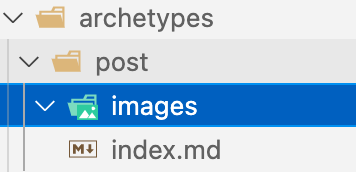

<!--more-->

# 前言

硕士毕业后，意味着人生中学生时代结束了，开启了新的篇章，因此又重新打开了尘封已久的博客。在研究生阶段，做的内容主要是计算机视觉，毕业后做的是后端开发，二者相差实在太大。虽然转型的过程比较痛苦，但对我来说也是一个新征程的起点，所以开了个新坑，记录一下毕业后的成长。

新的博客，新的工具。所以这次我用Hugo来代替Hexo作为我的博客引擎。原因一方面是自己喜新厌旧、爱折腾的特点，另一方面Hugo生成网页的速度是真的快。所以新博客第一篇，就从迁移的过程开始吧。

# 迁移步骤

hugo生成一个网站还是很方便的。按照[官网步骤](https://gohugo.io/getting-started/quick-start/)一步步安装即可。在创建完网站之后，就可以clone主题写文章了。

我这里使用的主题是[Even](https://github.com/olOwOlo/hugo-theme-even)，Logo生成使用[favicon.io](https://favicon.io/favicon-generator/)，获取不同尺寸的Logo是用[favicomatic.com](https://favicomatic.com/).

下面重点讨论一下在迁移过程遇到的问题。

# 遇到的问题

## 图片相关

### 插入图片

Hugo有两种方式管理静态资源，一种是全部放到static文件夹下，在站内直接按文件名访问即可。在配置文件中还可以对修改加载静态资源位置。具体可查看[Static Files](https://gohugo.io/content-management/static-files/).

第一种方式有个问题就是，所有文章的所有静态资源（图片）都会放在这个文件夹里，就很不好管理。所以我更倾向于第二种方式。在Hugo 0.32版本之后，可以将一个页面的所有静态文件全部放在一起，称作`Page Bundle`.

[Page Bundles](https://gohugo.io/content-management/page-bundles/)是一种管理资源的方式，分为Leaf Bundle与Branch Bundle两种。我们这里主要使用Leaf Bundle。

Leaf Bundle是在content目录下新建一个文件夹，文件夹中index.md用于编写网页的内容，然后新建一个image子目录用于存放图像。在index.md中可以直接使用相对路径访问``.如下图所示：



### VSCode快速插入图片

另外我们在插入图片时，肯定不想先把图片保存到images文件夹下，再在md中引用。所以我用了[Markdown Paste](https://marketplace.visualstudio.com/items?itemName=telesoho.vscode-markdown-paste-image)插件。当你将图片复制到剪贴板后，可以直接使用`Cmd+Alt+V`粘贴到markdown中，图片会保存到你指定的目录，我这里配置的是：

```
{
	"MarkdownPaste.path": "${fileDirname}/images/"
}
```

也即当前文件的同级images目录。

### 控制图像大小

Markdown本身并没有提供控制图像大小的方法，只能插入Html语句控制，这个过程有比较麻烦。我查了一下，hugo提供了插入图像的Shotcode，在转换为html的过程中Hugo会自动将这些shotcode展开，展开成一段html。其中图像的shotcode如下：

```

```

生成的Html为：

```html
<figure>
  
  <figcaption>
      <h4>Steve Francia</h4>
  </figcaption>
</figure>
```

其中，figure提供了width和height标签控制大小。更为详细介绍见[Shortcodes](https://gohugo.io/content-management/shortcodes/).

### 使用腾讯云存储托管图片

如果将图片托管到Github上，国内访问可能不是特别稳定，所以我这用了腾讯云存储，免费额度应该就够用了。

默认情况下，Hugo是用相对路径访问bundle下的图片，如果我们要换腾讯云，首先要将图像的链接替换为腾讯云网页。在Hugo 0.62之后，提供了[Markdown Render Hook](https://gohugo.io/getting-started/configuration-markup/#markdown-render-hooks)的功能，可以覆盖markdown的某些渲染功能，我们这里用来将图像的链接替换为腾讯云的地址。

首先，在config.yml下创建参数：

```
  [params.COSUrl]
    enable = true
    Host = "https://blog-1302636809.cos.ap-beijing.myqcloud.com"
```

然后创建`layouts/_default/_markup/render-image.html`，内容如下：

```
{{- $img_destination := .Destination -}}
{{- if (and .Page.Site.Params.COSUrl.enable (not .Page.Site.IsServer)) -}}
    {{ if not (hasPrefix .Destination "http") }}
    {{ $img_destination = (print .Page.Site.Params.COSUrl.Host (path.Join .Page.RelPermalink .Destination)) }}
    {{ end }}
{{- end -}}


```

其中`.Page.RelPermalink`是Hugo生成当前页面后，当前博客的地址，`.Destination`是图片相对当前页的地址。将二者与腾讯云存储的地址组合即可。

为了提高国内不同地区的访问速度，还可以给存储桶设置CDN。设置CDN后还可以减少桶的流量消耗。使用方法是在腾讯云Bucket管理中的域名设置里添加国内静态加速即可得到一个CDN加速域名，替换上述配置中的COSUrl即可。



## 设置Github Actions

我现在使用Github管理博客内容的方式是：

- master分支保存博客源码
- gh-pages分支保存生成的静态网站

通过Github Actions可以在将源码推送到master分支后，自动生成网站内容到gh-pages分支。具体配置见[hugo.yml](https://github.com/Gummary/gummary.github.io/blob/master/.github/workflows/hugo.yml)

## 设置Page模板

我这里设置Page的模板主要利用Hugo提供的[Archetypes](https://gohugo.io/content-management/archetypes/)功能。Archetypes就是生成content时使用的模板，主要包含了生成新的博客时使用的front matter.

我们在创建新的博客时使用的命令是：

```
hugo new posts/my-first-post.md
```

Hugo就会按照如下的顺序查找archetypes:

1. archetypes/posts.md
2. archetypes/default.md
3. themes/my-theme/archetypes/posts.md
4. themes/my-theme/archetypes/default.md

所以我们可以根据需要在上述的四个位置定义模板。那么Hugo是怎么知道我们用哪一个模板呢？也有两种方式：

1. 根据路径匹配
2. 在使用new命令时指定

例如上述例子中，Hugo就会自动匹配posts类型的archtype。

手动指定的方式如下:

```
hugo new --kind post-bundle posts/my-post
```

另外Archtype可以是文件夹，创建博客时Hugo也会根据Archtype的文件夹结构自动创建一个文件夹。我这里创建的是：



但是我这里images没有文件，所以生成新博客时Hugo没给我创建，我还是要手动创建- -!

## 添加时间戳

在使用`hugo new`创建一个博客时，hugo会以博客名称作为文件夹名称，当博客多了之后，博客命名不规则就会导致很不美观。一种最简单的方式就是加一个前缀，但是我没找到Hugo内置的方式这么做。所以找了一个脚本实现：

```bash
#!/bin/bash
set -e
POST_SLUG="$1"
if [ -z "$POST_SLUG" ]; then
  read -p "Post Name (e.g. your-new-post): " POST_SLUG
fi
TIMESTAMP=`date +%Y%m%d%H%M%S`
POST_FILENAME="${TIMESTAMP}-${POST_SLUG}"
hugo new "posts/${POST_FILENAME}"
```

这个脚本会根据你输入的文件名，自动生成一个格式为`20210807xxxxxx-文章名`的文件夹，内容为你设置的模板内容。

由于我的模板中title和slug设置的是文件名，那么就会包含这个时间戳，所以我的模板改成了通过正则表达式去除时间戳：

```
---
title: "{{ .File.ContentBaseName | replaceRE "^[0-9]{14}-" "" | replaceRE "-" " " | title }}"
slug: {{ .File.ContentBaseName | replaceRE "^[0-9]{14}-" ""  }}
date: {{ .Date }}
draft: false
---
```
然后又有了新的问题就是，他会将我的title和slug设置为index，而不是文件夹名，每次我还要自己改，所以我又在脚本最后加了下面两行替换代码，自动替换title和slug：

```
sed -i '' "s/title: \"Index\"/title: \"$POST_SLUG\"/g" content/posts/${POST_FILENAME}/index.md
sed -i '' "s/slug: index/slug: $POST_SLUG/g" content/posts/${POST_FILENAME}/index.md
```

*Warning:我这里用的是mac的bash，sed命令与linux有所不同，linux下不需要''*

## Windows下写博客

由于我工作使用的是Mac，私人笔记本使用的是Windows，为了自己在家也能写博客，我又加了一个powershell脚本用于初始化博客。

```powershell
if ($args.Count -eq 0) {
    Write-Host "Please input blog name."
    exit
}

$POST_SLUG=$args[0]
$TIMESTAMP=Get-Date -Format "yyyyMMddHHmmss"
$POST_NAME="${TIMESTAMP}-${POST_SLUG}"


hugo new "post/$POST_NAME"

(Get-Content content/post/$POST_NAME/index.md).replace('"Index"', """$POST_SLUG""") | Set-Content content/post/$POST_NAME/index.md
(Get-Content content/post/$POST_NAME/index.md).replace('slug: index', "slug: ""$POST_SLUG""") | Set-Content content/post/$POST_NAME/index.md
```

## 评论系统

我这里使用大家都推荐的utterances作为评论系统，我当前使用的Even版本(4.1.0）已经内置支持了。

所以只需创建存放评论的仓库，然后在配置文件中修改对应的参数即可。

# 参考博客

1. [公式问题](https://geoffruddock.com/math-typesetting-in-hugo/)
2. [环境搭建](https://sspai.com/post/59904)
3. [图标生成](https://favicomatic.com/)
4. [行内公式显示](https://stackoverflow.com/questions/27375252/how-can-i-render-all-inline-formulas-in-with-katex)
5. [图标制作](https://favicon.io/favicon-generator/)
6. [使用 Github Actions 來自動化部署 Hugo 到 Github Pages](https://blog.puckwang.com/post/2020/use-github-actions-deploy-hugo/)
7. [本站引用图片的“顺滑”流程](https://wrong.wang/blog/20190301-%E6%9C%AC%E7%AB%99%E5%BC%95%E7%94%A8%E5%9B%BE%E7%89%87%E7%9A%84%E9%A1%BA%E6%BB%91%E6%B5%81%E7%A8%8B/)
8. [腾讯云对象存储博客图床开启 CDN 加速(不需要购买额外域名)](https://jdhao.github.io/2020/03/16/tencent_cos_cdn_setup/)