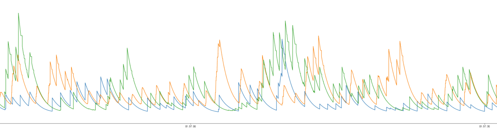
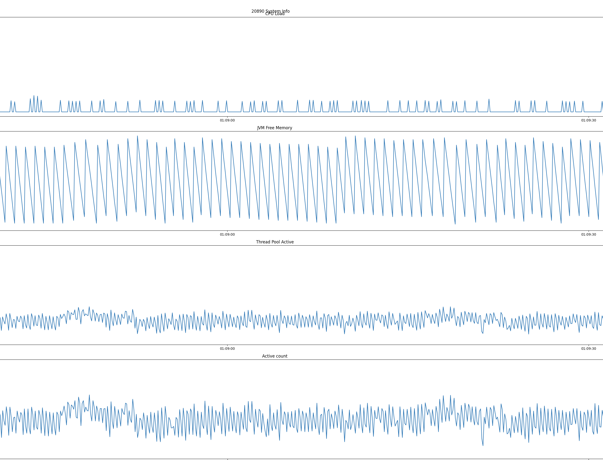

<!--more-->

# 参赛心得

没毕业的时候就和铁铁MTFighting约好，每年肝一次天池中间件比赛，今年比赛一出就报名了，今年本来目标是能进第一页就行，后来工作需求一多就没时间肝了，最后摸了个25名，和第一页差5名，明年继续努力吧Orz

# 解题思路

一开始拿到赛题的时候看到赛题是“三个 Provider 的每个 Provider 会随机离线”，于是就想整一个实时检测是否离线的心跳。找了半天提交之后，完全没用，加群才发现不是关机的这种离线。

然后开始看官方发的赛题分析，这个分析对我们的帮助巨大。视频里提了个三个点：

1. 容量评估，根据服务端性能进行评估处理
2. 快速失败，本次比赛是以总的并发量去进行压测，对于一些超过预期的请求提前结束，提高总的吞吐量
3. 自动探测，对服务容量进行动态分析，达到所有时间的最优解

下面针对这几个点给出我们尝试的的一些有用策略。

## 自动探测

这部分我理解就是做均衡，根据Provider的状态把请求分配到容量最低的节点上。但是这部分我们一直没有好的方法。最开始我们用的随机随机，后来尝试了PeakEwma算法效果也不是很理想。然后又试了最小连接数，比随机算法高一些，所以就用这个当作Baseline开始容量评估和快速失败的探索。

在探索的过程中，我们发现20890的最大线程数是500，20880和20870的线程数是300，但是20880处理请求的能力比20870的是弱一些的。但是最小连接数算法是不care这些的，基本相当于是一个轮训算法，最后每个Provider的并发数都是一样的。所以我们中间做了手动加权处理，给20890分配更多的请求，20880分配少一些请求。

```java
int active = rpcStatus.getActive();
if (port == 20890) {
	active -= 100;
	active = Math.max(0, active);
} else if (port == 20870) {
	active -= 20;
} else {
	active += 20;
}
if (active < minActive) {
	minActive = active;
	minIndex = i;
}
```

由于复赛不提供日志，没办法直接根据端口硬编码，所以改成了将线程池大小作为权重的加权轮训负载均衡，在初赛验证发现效果和最小连接数差不多，就一直沿用到了复赛。

## 快速失败

快速失败在比赛开始是实现最简单，提分最有效的。在代码中将客户端的超时写死成20ms，能直接提高大约200w分。

```java
RpcContext.getClientAttachment().setObjectAttachment(TIMEOUT_KEY, 20);
```

后来赛题改了，设置一个固定超时时间将不再生效，于是我们就开始换成动态探测的方式估计超时时间。为了能快速的根据Provider端处理时间变化而变化，我这里选用了指数加权移动平均（EWMA），但是效果并不好，把估计的超时时间画出来得到的效果如下图所示，估计的处理时间在50-200ms波动，可以说完全没有效果。原因的话，大概是EWMA受最近请求的往返时间影响比较大，如果出现一个Rtt较高的请求，那么之后一段时间估计的值都会在这附近。



于是又换成了固定超时时间的方法，这次加上了随机的抖动，防止超时不生效。

```java
double observeRtt = 20.0 + ThreadLocalRandom.current().nextDouble(-2, 2);
RpcContext.getClientAttachment().setObjectAttachment(TIMEOUT_KEY, observeRtt);
```

之后就拿这个当作Baseline去做容量评估了。由于比赛方最后会检测这种随机抖动的情况，所以在A榜的最后一周又回来写估计超时时间的算法。想了一下午没想到合适的解决方案，最后没办法，就硬上TCP估计Rtt的方法，没想到竟然意外的好用，于是就作为最终方案保留到复赛。分析原因的话，TCP估计Rtt的方式和EWMA恰好相反，TCP给之前估计的RTT更多权重，而EWMA给最近的RTT更大权重，所以对于一次比较大的Rtt，我们应该用之前估计的值将其平滑掉。

使用TCP后的图回家补。

## 容量探测

容量探测的部分是做动态估计Rtt做不下去了，客户端这边整不出花活，所以开始研究服务端了。我这边统计了Provider端CPU Load、JVM Free Memory、Dubbo线程池中活跃的线程数量，对比了当前的并发量，如下图所示：



可以看到，只有活跃线程数和当前并发数是一致的，所以就直接从这个开始下手了。最开始的简单粗暴的把活跃线程数限制死，由于不同Provider的最大线程数不同，所以我将(活跃线程数/最大线程数)限制在0.4，没想到直接把分数从1300w干到了1647w，当时人都傻了。后来分析原因也很简单，Gateway这边我们只是根据线程池大小做了简单的加权轮训，所以Gateway这边其实是感知不到Provider的状态的，只是一个冷酷无情的发请求机器。所以看Provider这边的并发量都很大，导致处理时间很长，在Provider限流之后，Provider这边的处理时间就比较低了。

但是写死一个固定的值也不是办法，所以后来我就开始研究限流算法。看了Netflix的concurrency-limits库之后，上了一版基于TCP Vegas的限流算法，但是效果很拉。后来想了下，原因是因为TCP Vegas是基于最小Rtt的，让处理时间在这个最小Rtt附近波动。但是我们比赛的场景是，请求的处理时间随着并发量增大而增大，那最小的请求不就是并发量为1的时候，所以上TCP Vegas直接就把流量限制死了。

这时候留给A榜的时间不多了，所以就没再尝试其他算法，又去做动态探测了。但是在写concurrency-limits的代码分析时意识到，其实可以给最小的Rtt做一个限制的。

# 总结

这次比赛收获还是很大的，一方面是自己技能的收获，至少把之前面试背的负载均衡算法、限流算法的具体实现都看了一遍，顺便也看了看Dubbo的源码。还有就是比赛本身收获，首先就是打比赛，日志画图很重要，清晰的把日志画出对分析赛题帮助非常大；另外就是理性分析也很重要，比如在看完Vegas算法就能想到过度限流的问题，乱尝试还是比较浪费时间的。

最后打一个广告，我在比赛时写了一些Dubbo源码分析的博客，感兴趣的同学可以看看～

博客地址：gummary.github.io


# 参考

1. 