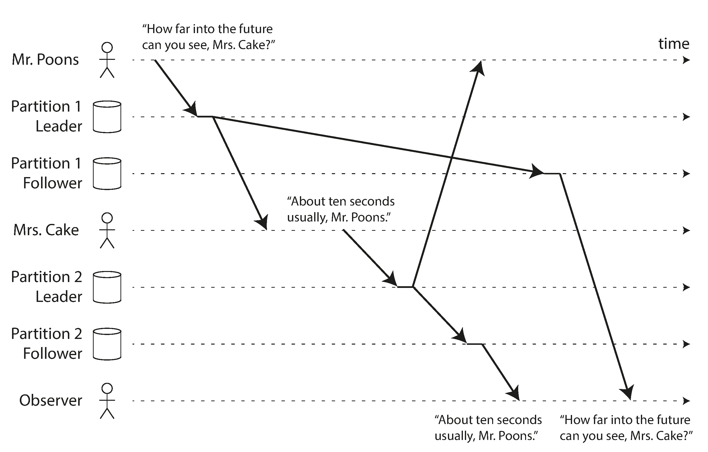

<!--more-->

# Chapter 5. Replication

将数据分布在多个数据节点上的好处：

1. 让数据和用户中间的物理距离更小，相应速度更快
2. 提高系统容错性
3. 提高系统读的吞吐率

## Leaders and Followers

为了保证各个节点的数据一致，通常采用的架构为主从式，如下图所示：



1. 用户将写请求发给主节点
2. 主节点处理请求
3. 主节点将修改请求转发给其他节点，其他节点再处理

## Synchronous Versus Asynchronous Replication

主节点与从节点之间的交互有三种：

1. 同步方式，主节点将更新请求发给所有从节点，所有从节点都更新成功，主节点才给客户端返回更新成功。但如果有网络波动或从节点异常，那客户端进行写操作时就会被阻塞或写入失败。
2. 异步方式，主节点给从节点发送更新请求后，不等从节点的返回结果，直接返回客户端。提高客户端的写效率，但无法保证从节点更新数据成功。
3. 半异步方式，某一个或几个节点使用同步的方式，其他节点使用异步的方式。保证至少有一个从节点的数据是完整的。

## Setting Up New Followers

数据集群中加入一个新的节点：

1. 构造一个老数据库的SNAPSHOT（这一步可以不需要锁）
2. 将SNAPSHOT发送给从节点
3. 从节点请求从SNAPSHOT至当前所有的新数据
4. 从节点处理完数据后即可作为一个新的节点工作

## Handling Node Outages

处理节点下线的难点在于，如何保证整个集群正常工作的情况下，重启某个节点。节点恢复之后，又能保证数据不丢失。

### Follower failure: Catch-up recovery

从节点本地存储了一份数据修改的日志，因此当从节点下线后，从节点可以从日志中回复数据，下线过程中新增的数据可以从主节点重新请求得到。

### Leader failure: Failover

主节点下线之后的处理流程通常如下：

1. 确定主节点下线。通常使用timeout机制判断节点是否下线
2. 选择一个新的主节点。在所有的从节点中，选出一个数据最全的从节点作为主节点。（共识算法）
3. 让客户端将更新请求转发给新的主节点，从节点向新的主节点请求数据。

这个处理流程中有很多问题：

1. 如果使用异步的方式进行同步，那么新选出的主节点可能信息不全。如果原来的主节点重启后重新加入集群，那么就会存在数据不一致的问题。通常处理方式是，丢弃原来主节点上新的数据。
2. 丢弃原来主节点的数据很容易会导致其他问题。特别是当有一些其他系统依赖本系统的数据的时候。
3. 某些情况下，可能会选出来两个节点当作主节点，这就会导致两个主机点之间的数据不一致，又没有合适的冲突处理方式，导致数据不完整。
4. 主节点的超时时间设置比较难。如果设置很大，那么检测出主节点超时就比较困难；而如果比较小，那么可能一次网络波动就会导致failover，影响性能。

## Implementation of Replication Logs

主从节点实现复制的方式有以下四种

### Statement-based replication

将每个更新数据的语句发送给从节点。

缺点：

1. 需要保证非确定性函数如RAND、NOW等的一致性。主库可以将语句中的非确定函数改为一个固定值来避免。
2. 如果更新操作有一些副作用，那么要保证这些副作用的结果一致。
3. 如果更新数据需要依赖库中的数据，那么要保证更新数据语句执行的次序是一致的。

### Write-ahead log (WAL) shipping

- 对于Log型的存储引擎，如SSTable、LSM-Tree等，数据主要存储在日志文件中
- 对于B-Tree，数据在更新前也会先写入一个日志文件中，供恢复使用。

因此对于这些数据引擎，实现数据的复制就可以通过发送日志完成。主节点除了写入日志，还会通过网络将日志发送给从节点。

这种复制方式的缺点在于，日志描述的数据库数据文件中哪些数据被修改了，因此日志的文件存储结构和存储引擎是强绑定的。

### Logical (row-based) log replication

另一种实现日志的方式是将日志的结构和存储引擎解耦。日志用于记录数据的修改内容：

1. 对于插入行，记录所有列的值
2. 对于删除行，记录插入的数据的唯一标识
3. 对于更新行，记录唯一标识和更新后的值

使用这种日志的好处是，从节点更容易进行存储引擎版本升级，甚至使用不同的存储引擎，日志还可以被其他应用程序使用。

### Trigger-based replication

之前三种都是数据库引擎本身的复制能力。有些情况下需要更大的灵活性，使用用户编写的程序实现数据复制。这种情况下可以使用数据库提供的触发器功能。应用程序首先注册数据的更新，在数据更新后，数据库调用应用程序代码。

## Problems with Replication Lag

由于网络延迟等问题的存在，主节点上的数据不会立刻同步到从节点。如果使用同步的方式复制数据，会大大影响性能，从节点越多，同步失败的可能性越大。而使用异步的方式，可能会对客户端导致一些问题。

### Reading Your Own Writes

客户端首先请求主节点写入数据，主节点向从节点同步数据，在还未同步完时客户端请求从节点数据，可能就获取不到刚插入的数据。



这种情况需要确保read-after-write consistency，也即用户读取的数据是他刚提交的。而对其他用户来说不保证读取的数据是该用户刚提交的。

一些措施实现这种一致性：

1. 在读取可能由用户自己修改的数据时，从主节点读取，否则从从节点读取。
2. 根据数据上一次更新的时间和当前时间的时间间隔决定从主节点还是从节点读，确保数据已经同步到从节点。
3. 客户端知道自己在什么时间点写入了数据，因此系统可以保证从节点在该时间点之前的数据是有效的
4. 从节点跨多个数据中心，那么所有与主节点相关的请求都要路由到包含主节点的数据中心。

如果应用是跨平台的，那么情况会更加复杂：

1. 不同平台连接的网络是不同的（蜂窝或光纤），那么请求就有可能路由到不同的数据中心。这时候就要确保请求会路由到同一个数据中心。
2. 记录数据最后的更新时间是很困难的，因为不同设备之间不知道其他设备是否再更改。

### Monotonic Reads

客户端向某个从节点请求数据后，如果跟另一个从节点继续请求，那么可能读不到数据或读到的数据比上一次读的旧。



一种解决办法是让用户每次都从同一个节点读，例如根据用户ID的hash值决定从哪个节点读数据。

### Consistent Prefix Reads

  

另一个可能导致的是消息的顺序问题。例如A向B发送了消息1，B向A发送了消息2，从A的视角来看，消息的顺序是消息1->消息2。但是由于延迟的存在，可能导致消息2先到达了C，导致C看到的顺序为消息2->消息1.

防止这种情况需要实现 consistent prefix reads。也即如果按照一定的顺序写入数据，那么读取数据时一定会按照该顺序读出来。

### Solutions for Replication Lag

在应用层处理时延的问题非常复杂且容易出错。因此数据库通常会提供事务来保证数据的一致性。

## Multi-Leader Replication

Single-Leader Replication的问题在于，只有一个节点可以接受写请求，因此当这个节点挂了之后，用户就无法写数据。

使用多个leader提供写请求的吞吐率。

### Use Cases for Multi-Leader Replication

**多数据中心场景**

一般multi-leader replication多用在多数据中心的场景下，例如每个数据中心一个主节点。相比singler-leader的好处在于：

1. 性能更好。用户可以向离其最近的数据中心写入。
2. 容错能力更强。如果使用single-leader，那么当主节点或所在的数据中心挂了，那么需要在其他数据中心中选出一个作为leader。
3. 对公网的性能要求弱一些。single-leader场景下，写请求需要同步写入到其他数据中心，因此对公网的要求更加敏感。

multi-leader可能导致的一些问题在于，需要处理并发写入的问题，也即要处理冲突。

**Clients with offline operation**

某些应用需要在无网络的情况下工作，这种也可以看作是一种多数据中心的情况，每个app所在的device是一个数据中心。

**Collaborative editing**

多人协作场景也类似。用户在本地对文档进行修改，然后异步同步给服务器及其他用户。

### Handling Write Conflicts

### Multi-Leader Replication Topologies

multi-leader最大的问题在于，写冲突。如果两个用户，同时向两个数据中心，对同同一份数据进行修改，那么两个数据中心在同步数据的时候就会冲突。

对于single-leader来说，A用户在写的时候，会请求一个锁；B用户只有在A用户写完之后才可以写，或事务回滚，过一会再写入。但对于multi-leader的情况，如果用了锁，multi-leader就会退化成single-leader。

另一种方式是避免冲突，同一份数据的修改只在同一个数据中心内完成，这样不同的数据中心就不会出现冲突。但是如果某个数据中心挂了，仍会出现同一份数据在不同数据中心写入的问题。

如果冲突无法避免，那就需要让数据最终趋向一致。single-leader中，写入数据的顺序是按写请求的顺序，但是multi-leader中无法确定两次请求的先后顺序。一些让数据趋向一致的方法：

1. 给每个写请求生成一个uuid，uuid大的作为后来的请求
2. 给每个节点一个uuid，uuid大的节点请求优先级高
3. 合并两个写请求
4. 同时保存这两个写请求，然后将写请求的取舍留给用户。例如git的代码合并。

### Custom conflict resolution logic

让用户自定义代码处理冲突，当有冲突时，数据库执行用户代码解决冲突。

- On write，再写入时如果有冲突，则调用用户代码处理冲突。
- On read，再写入时，保存写入的内容，在读取时，如果遇到冲突，那么交由用户处理冲突。

### Multi-Leader Replication Topologies

multi-leader之间同步写消息的方式通常有以下几种：



circlar和star这两种同步方式中，一个消息会经过多个节点。因此节点内需要记录是否处理过某个请求，防止出现无线循环。另一个问题是，如果某一个节点挂了，同步过程就会中断。一般需要手动忽略这个失败的节点。

all-to-all的问题在于，可能出现类似“Consistent Prefix Read”的问题，如下图所示：



## Leaderless Replication

Leadersless的实现通常有两种，客户端直接向多个节点写入，或客户端向某一个协调节点发送请求，由协调节点代表客户端向节点发送写请求。

### Writing to the Database When a Node Is Down

当节点下线时，客户端并发向所有节点发送写请求，只有成功处理的请求会返回正确结果。在读取时，如果下线的节点重启后上线了，那么客户端从该节点中读取的数据就是过时的数据。客户端可根据各个节点返回数据中的版本号决定哪一个时新的数据。

数据库系统为了保证最终的数据是一致的，通常采用两种方式：

1. Read repair，在读取时判断版本号，向旧版本的节点发送新的请求数据。如果某些数据读取的频率很小，那么其更新的频率也很小，可能会出现数据的丢失。
2. anti-entropy，使用一个后台线程，扫描各个节点之间的数据差异，并更新旧版本的数据。

### Quorums for reading and writing

在向节点写入数据时，写入多少个节点认为是写入成功，读取时，多少个节点返回结果认为读取成功呢？假设共n个节点，读取和写入的数量分别为r和w，一般来说需要w+r>n.n通常是整数，w和r一般是(n+1)//2.

### Limitations of Quorum Consistency

Quorum consistency只是理想情况下的约束，有很多edge case会让这个约束失效：

1. write concurrently
2. write和read并发发生，无法确保read返回的是新值还是旧值
3. 如果某些节点在写时失败了，而成功的节点没有回滚，就会导致约束失效
4. 节点更新了数据库中的值，但是下线了，上线时从其他节点读取的确实旧值，会导致约束失效

在Leaderless的架构中，很难监控各个节点值的是否是最新的。

### Sloppy Quorums and Hinted Handoff

在某些情况下，某个客户端可能因为网路问题无法连接到大量的数据库节点，这时有两种选择：

1. 认为写入失败
2. 写入到不位于这n个节点中的节点

第二种方法称为sloppy quorums。

当网络恢复时，再将写请求发送给应该写入的节点，这个过程称之为hinted Handoff

对于leaderless架构同样支持多数据中心的操作。n可以是所有数据中心中的所有节点，也可以是一个数据中心的节点，不同数据中心的数据同步由异步线程完成。

## Detecting Concurrent Writes

Concurrent Write 是指多个用户同时对一个Key进行修改，多个用户之间并不知道彼此的存在。



由于不同用户的网络环境不同，请求到达各个节点的顺序不同。如果节点只根据请求到达的时间处理请求，那么不同节点上存储的数据就会不一致。

一种解决数据不一致的方式是让各个节点只保存最近修改的数据，覆盖历史的数据。这就需要各个节点先对“时间”达成一致，设定某种策略，保证每个请求在时间上不会冲突。当新请求到达时，节点根据请求的时间，决定是否覆盖。这种策略称之为Last write win。

> Cassandra 为了防止数据冲突时，整个数据都被覆盖，将数据按列存储，使用LWW时，只会覆盖某一列的值。

LWW有一个问题在于当多个客户端同时对一Key写入时，即使给每个客户端都返回了写入成功，但是某些客户端写入的值会被丢弃。

### Happen before

另一种解决方案是数据库保存多个客户端修改的值，客户端每次先请求数据库时，都从库中读取数据，然后再写入。那么如何确定两个请求是否是并发的呢？这里需要用到“happen-befer”原则。假设我们有两个请求A和B，A先修改数据，如果B是在A修改的结果上进一步修改，那么记作A->B，也即A happen before B。如果不是，则就认为A和B是并发的。所以任意两个请求之间就只有以下三种关系：

1. A happens before B
2. B happens before A
3. A 与 B并发执行

### Capturing the happens-before relationship

happens-before关系的识别可以看下rika的博客：https://riak.com/why-vector-clocks-are-easy/。

简单来说，客户端每次修改数据时，都携带一个版本号，数据库认为该修改请求是在该版本号的基础上修改的，是先序关系，而其他比该版本号大的请求均为并发关系。

# Chapter 6. Partitioning

# Reference

1. https://dev.mysql.com/doc/internals/en/replication.html
2. https://www.datastax.com/blog/why-cassandra-doesnt-need-vector-clocks
3. https://riak.com/why-vector-clocks-are-easy/