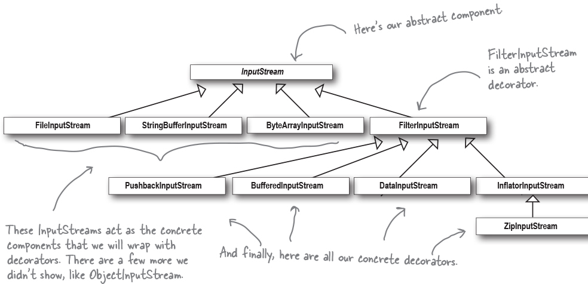

<!--more-->

# 观察者模式

## 简介

是一种一对多的模式

应用的设计原则：

1. 分离容易变化的和不变的：观察者数量和被观察者状态是变的。
2. 面向接口编程：观察者使用接口注册，被观察者存储接口List
3. 使用组合而不是继承：被观察者包含一些观察者，而不是继承关系

## 缺点

update时可能会出现推送不必要的信息。

解决方案：Subject中定义一些获取信息的接口，由观察者决定获取哪些信息。

但是这种情况不适合多线程。Observer获取信息时，可能Subject的信息已经变化了。

push和pull对比。


# 装饰器模式

装饰器模式主要针对扩展类功能。通常扩展一个类的功能可以使用继承。

使用继承的问题在于，父类的功能不是所有的子类都需要，如果这些功能下沉到子类，则多个子类之间又会有代码的重复。

而如果这些功能发生变化，要么修改父类中的方法。

使用继承来实现类功能的扩展无法满足开闭原则：在**不改变现有代码**的情况下实现**对类功能的扩展**。

使用装饰器模式：



通过装饰类对原始类进行包装，对原始类的功能进行扩展。

装饰器模式中使用继承来确保装饰后的接口类型不变，而将原始类放到装饰类中，用组合实现对原始类的功能扩展。

在Java的IO工具包中就使用了装饰器模式：




装饰器模式的缺点：

1. 每个装饰器都是一个类，因此可能会产生很多小的装饰类，不容易理解代码
2. 在客户端需要确切类型的时候不生效
3. 初始化的过程会更加复杂


# 工厂模式

工厂模式针对的问题是类的创建过程。Java中通常使用new来创建新的对象，使用new的问题在于，代码会和某个精确的类型绑定。之后如果增加新的类型，就需要修改创建的代码，违反了开闭原则。

```java
// 这里pizza对象会和CheesePizza强绑定
Pizza pizza = new CheesePizza();

// 之后对pizza的操作也只是对CheesePizza修改
pizza.bake()
pizza.cut()
```

一种常见的方法是将创建类的过程封装到一个类中，只由这个类来完成对象的创建，这样之后添加一个新的类型只需要修改封装的函数即可。有了这个封装的方法后，如果有其他地方也需要这个类，可以直接调用该类的创建方法。为了区分，将这个方法称为简单工厂。

对于一个类型来说，可能许多处理逻辑都是类似的，因此可以考虑将这些类似的逻辑收敛到一起。用一个父类封装统一的处理方法，而将构造对象的过程下放到子类，实现类的加工和类的创建解耦，称这种模式为工厂方法模式。

简单工厂和工厂方法模式之间的区别在于，前者加工和创建的过程是分开的，创建的类是加工类中的一个成员变量，使用的是组合；而工厂方法是将加工和创建的过程放到一个类中，由父类负责统一的处理，子类负责实现，使用的是继承。

二者之间还有一个区别在于，工厂方法模式更加灵活。如果对创建的类继续进行分类，使用简单工厂，则需要创建多个不同类型的工厂，在使用时，需要先new一个工厂，再使用工厂的创建函数。对工厂的创建同样违反了开闭原则。而对于工厂方法模式，如果出现一个新的类型，则只需要继承父类，实现一个新的子类即可。



工厂方法引入了一个新的设计原则：

依赖反转：面向抽象类编程，而不是具体的类。

一些遵守该准则的方法：

1. No variable should hold a reference to a concrete class.
2. No class should derive from a concrete class.
3. No method should override an implemented method of any of its base classes.

简单工厂和工厂方法模式都是只创建一个类，如果一个大的类型下面有多个类，此时可以在一个抽象类中，添加多个创建函数，让子类实现具体的创建过程，将这种模式称为抽象工厂。抽象工厂是通过组合的方式，作为一个成员变量放到其他的成员类中。


# 命令模式

命令模式是将任务的请求者和任务的实际执行者进行解耦。适用于请求方是一个统一的入口，而实际的执行对象有多个且可能会变化的场景。



命令模式通过一个Command接口实现解耦，Command接口中只包含调用的函数，具体如何执行则由该接口的具体实现完成。

在每个Command接口的具体实现中，包含了实际执行该动作的对象和执行时需要的信息。

当有一个新的请求时，只需要创建一个对应的Command类，封装好具体的执行对象，由执行者直接调用接口的执行方法即可。



之前的监听者模式其实也是一种命令模式。监听者接口可以看作是Command接口，update()函数就是实际的执行函数。注册监听者时就是创建实际的命令对象，当有事件发生时，监听者会被回掉，执行具体的任务。

# 适配器模式

适配器模式主要用在两个已有系统的对接上，可以不修改双方接口，通过一个中间层——适配器，完成双方系统的对接。



与装饰器模式类似，适配器模式也是对一个接口进行包装。但是装饰器模式是对一个类赋予更多的职责，而适配器是在不改变当前类功能的情况下对一个类进行包装，将其行为变成另一个类。

## 外观模式

外观模式主要是为了简化一个子系统，使用一个简单的api来简化一个子系统，提高子系统的可读性。



外观模式中应用的设计原则：尽可能降低某个系统涉及的类。

通过降低接触类的数量，当某个类发生变动时，可以减少系统的修改。

对于一个类的方法来说，应当只访问以下几种方法：

- 类自身的
- 参数的方法
- 方法初始化的类
- 类的成员变量

例如：



当Thermometer发生变化时，我们只需要修改Station类即可。

# 迭代器模式

## Composite模式

# 状态模式

状态模式主要用于对象行为随着对象本身状态改变的场景。对象在不同状态下可以采取一些相同的行为，但是在不同状态下，这些行为的执行过程不同。

在画出对象状态流转的状态机后，定义对象所有可以进行的操作，然后再定义每个操作在每个状态下的行为。

一种实现方式是：

```java
public class ExpenseOperator {
    private ExpenseWorkflowState currentState;
    
    public void submitExpense() {
        if (currentState == ExpenseWorkflowState.DRAFT) {
            System.out.println("submit expense");
        } else if (currentState == ExpenseWorkflowState.AUDIT) {
            System.out.println("already submit");
        } else {
            // ...
        }
    }
}
```

在每个操作中都需要判断当前对象是在什么状态，每当新增一个状态时，需要在所有的操作中新增对新状态的判断，违反了开闭原则。

使用状态模式可以将具体的State的封装成一个接口，接口中包含所有对象可进行的操作，当调用对象相应的方法时，直接调用当前状态对应的方法即可。

```java
public class ExpenseOperator {
    private ExpenseWorkflowState currentState;
    public void submitExpense() {
        currentState.submitExpense();
    }
}

// 状态接口
public interface ExpenseWorkflowState {
    public void submitExpense();
}

// 具体状态实现
public class ExpenseAuditState implements ExpenseWorkflowState {
    @Override
    public void submitExpense() {
        System.out.println("already submit");
    }
}

public class ExpenseDraftState implements ExpenseWorkflowState{
    @Override
    public void submitExpense() {
        System.out.println("submit expense");
    }
}
```

这么做的好处是当新增一个新的状态时，只需要实现对象在各个状态下的行为，调整下与该状态相关状态的行为即可，不必对所有状态都进行修改。

对象状态之间的过渡如果是固定的，那么可以放在Context中，否则放在具体的State中。为了避免State之间过度依赖，可以在Context中使用get方法，获取对应的状态，get方法返回的是State接口，而不是具体的类。

状态模式和策略模式非常相似，但是二者之间的本质区别在于对象状态（具体策略）的过滤逻辑。状态模式的状态变化是客户端调用具体行为之，自发改变的，客户端是无感知的；而策略模式是客户端主动选择不同的策略执行。