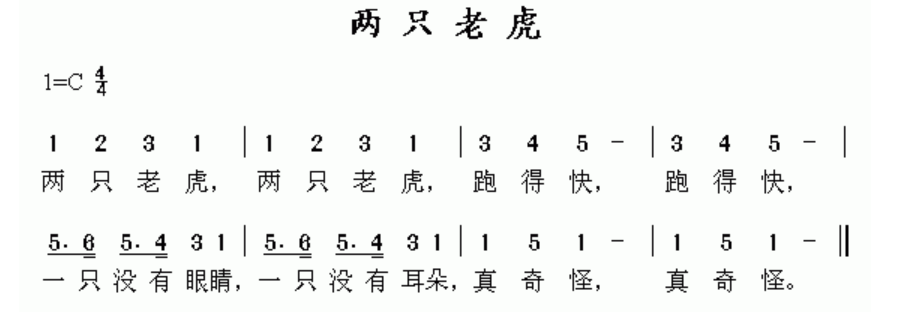

<!--more-->

# 认识简谱

下面是一个简谱：

其中，两只老虎是标题，左边1=C是调号，4/4是拍号。

在ktv或者音乐节目中，可能我们经常会听到升key或者降key，就是说的这个升调和降调；而拍号则是控制整首歌的节奏，比如动次打次、动次次动次次等。

知道这两部分的名字是什么后，我们再来看下具体怎么解释调号和拍号。

# 音名和唱名

我们先来看1=C。其中左边我们称之为唱名，右边的C称之为音名。

在我们刚刚简谱里的正文部分，我们我们可以看到歌词上面都有一些数字，这些数字就是我们熟知的do re mi fa sol la si，写作1234567。

然后再来看下唱名，学习唱名需要用钢琴帮助我们更好理解什么是音名。

我们先来看下钢琴的整体构造，钢琴由88个键组成，其中如下图所示的7个白键和5个黑键为一组。

为了能够在演奏的时候确定按哪个键，就需要对这些键命名，而这些键的名字就是音名。

以一组键盘按键为例，白键从左到右我们分别记作CDEFGAB。下一个小组依然是CDEFGAB。

知道了唱名和音名之后，我们来理解下1=C，依然用钢琴来举例。1=C就表示，当我们在曲谱上看到1时，就要弹奏C这个键。那DEFGAB就分别表示234567.

既然1可以为C，那么1当然也可以为D。如果一个简谱的调式为1=D，那么就表示D为1，此时EFGAB就不能简单的时23456了，有些唱名会由黑键来弹奏，如下图所示。

而1=EFGAB时各个唱名的位置如下所示：

那么为什么1=C都是白键，而1=D的时候有的在白键，有的在黑键呢？我们再来看下钢琴中黑键的表示方法。

大家需要知道，虽然黑键比白键小，而且在上面不容易按，但是黑键的地位是和白键相同的。在有了白键的命名方式后，我们也给黑键进行命名。

以C和D中间的黑键为例，他在C的左边，我们就称之为C♯，在D的右边，我们也称作D♭。其他黑键的表示如图所示：

   

给黑键命名之后，我们来看下钢琴上键与键之间的关系。我们知道，音乐是有高音和低音的，比如不同的do，那么我们怎么能描述高低音之间的关系呢。

这里引入两个概念，半音和全音。半音就是指相邻两个音，他们之间的距离就是一个半音。

还是以钢琴距离，C和C♯之间就是一个半音关系，同理C♯比D低半音的距离。

了解了半音之后，就很容易理解全音，一个全音的距离其实就是两倍的半音，如下图所示：

  

接下来我们回到刚刚的问题，为什么在1=C、1=D时都能弹出1234567，但是他们的键位确实不一样的呢？这时候我们需要了解下，1234567他们的内在的规律。

我们以1=C为例，来看下1234567这七个音之间的音程关系，根据我们刚刚了解的，相邻键之间是半音关系，那么我们很容易得出他们之间的关系为全全半全全全半。

  

我们再来看下1=D：

  

可以发现，同样也满足全全半全全全半。对于其他的音名来说，也是相同的，这里就不展开了。也就是说，不管你从哪个音开始弹，只要满足全全半全全全半这个关系，弹出来就是1234567这个感觉。

有了这个规律之后，我们不能每次说这个组合的时候都说全全半全全全半，我们需要给他起一个名字，这个名字就是调式。

> 调式是若干个以特定顺序连接起来的音以一个主音为中心形成的集合[1]。这些音互相之间具有某种特定的音程关系，并在调式中担任不同的角色。调式是决定音乐风格最重要的因素之一。调式和调性结合，决定了该段音乐所用的调。将调式中的所有的音从主音开始，按照音高从低到高排成一列，就是该调式的音阶。

简单来说，调式就是一组音按一定的规律排列起来。如果这一组音是什么确定了，规律确定了，那调式就确定了。目前调式的种类如图所示：

- 大调
- 小调
- 中古
- 五声调式

那么刚刚我们说的全全半全全全半起一个名字，就叫做自然大调，因为这个调式经常被用，所以我们一般直接称之为大调。

当1为C时，我们称之为C大调，为D时称之为D大调。对于一个调式里将音从低到高排列，从主音开始，到主音结束的排列，我们称之为音阶，例如C大调音阶就是CDEFGABC。

了解音名唱名调式音阶之后，再回到钢琴和简谱上，我们知道钢琴上有很多组，那么每个组都有C，而简朴上只有一个1=C，这里的C应该是钢琴中

